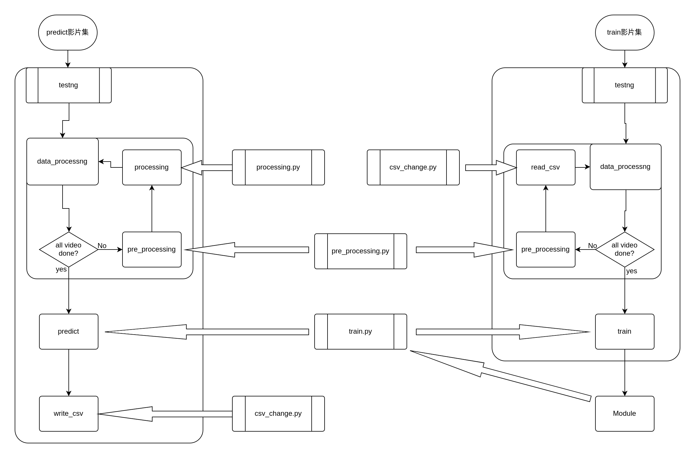

# Developer API Documentation

## Data Flow & Service Flow


cube定義
np.ndarray[720,1280,3,11]

# program
## training.py
training主程式
### *`main()`*
```python
def main() -> :
```
將影片集經過Data_processing過後，餵給training得到Module
#### **Parameters**
- `path`: 影片集路徑
#### **Return**
- Module:訓練好的模型

### *`Data_processing()`*
```python
def Data_processing() -> :
```
將影片集中每一拍的cube切分出來，並合成成一個array+一個csv，並以.pickle檔分別儲存下來
#### **Parameters**
-`path`:影片集路徑
#### **Return**
-`path`:影片pickle檔路徑(np.ndarray[8000,720,1280,3,11])
-`path`:CSV pickle檔路徑

### *`read_csv_random_shot()`*
```python
def read_csv_random_shot() -> int[]:
```
將一個csv中擊拍frame的數字隨機在+-5中取出
#### **Parameters**
- `path`:要讀取的csv路徑
#### **Return**
-`int[]`:各個拍子所在的隨機幀數

## testing.py
testing主程式
### *`main()`*
```python
def main() -> :
```
輸入欲辨識的影片集路徑，將影片各自經過pre_pro,procrss,data_process,predict後，輸出成一個csv檔
#### **Parameters**
- `path`: 影片
#### **Return**

### *`Data_processing()`*
```python
def Data_processing() -> :
```
將拿到的拍數，去影片中切出cube並給pridict預測參數
#### **Parameters**
-`int[]`:預測的拍數及frame 
-`path`:影片資料夾路徑
#### **Return**

## src/pre_process.py
影像前處理(將影像變成統一格式)
### *`get_background()`*
```python
def get_background(path:str) -> np.ndarray[],str:
```
讀取影片後,將背景分離出來,回傳背景與去背的影片
#### **Parameters**
- `path`: 影片路徑
#### **Return**
- `np.ndarray[]`:背景照片
- `str`:去背的影片所存成的.jpg檔案夾路徑

### *`get_field()`*
```python
def get_field(background:np_array) -> list[(x,y)]:
```
利用背景找片找出會用到的場地範圍，排除觀眾席等等雜訊
#### **Parameters**
- `background`: 背景照片
#### **Return**
- `list[(x,y)]`:場地的範圍 (左上、右上、左下、右下)

### *`cut_field()`*
```python
def cut_field(path:str,field_range:list[(x,y)]) -> str:
```
將path中的影片超過field_range的部分就全部設為0
#### **Parameters**
- `path`: 欲切割的影片
- `field_range`:要切割的範圍
#### **Return**
- `str`:切割場地後的影片所存成的.jpg檔案夾路徑

## src/img_process
利用tracking跟moment判斷擊拍時間
### *`tracking()`*
```python
def tracking(path:str) -> list[]:
```
讀取影片後，利用tracking的技術去判斷，並回傳球位置、攝影機方球員位置、攝影機對面球員位置。
#### **Parameters**
- `path`: 影片路徑
#### **Return**
- `list[]`:各個追蹤的物件 \
    [第一frame[[`羽毛球左下x`,`羽毛球左下y`,`羽毛球高h`,`羽毛球寬w`],[`這方球員左下x`,`這方球員左下y`,`這方球員高h`,`這方球員寬w`],[`對方球員左下x`,`對方球員左下y`,`對方球員高h`,`對方球員寬w`]],第二frame[]...]

### *`moment()`*
```python
def moment() -> :
```
利用讀取到的位置，採用動量的方法去判斷拍數及各拍大概所在的frame。
#### **Parameters**
- `path`: 影片路徑
- `list[[[]]]`:各個追蹤的物件 \
    [第一frame[[`羽毛球左下x`,`羽毛球左下y`,`羽毛球高h`,`羽毛球寬w`],[`這方球員左下x`,`這方球員左下y`,`這方球員高h`,`這方球員寬w`],[`對方球員左下x`,`對方球員左下y`,`對方球員高h`,`對方球員寬w`]],第二frame[]...]
#### **Return**
- int[`第一拍的frame`,`第二拍的frame`,...]:預測的拍數及frame 

## src/training
### *`take_out_11frame()`*
```python
def take_out_11frame() -> np.ndarray[[]]:
```
從影片中取出預測擊拍當下前後5個frame 
#### **Parameters**
- `path`: 影片路徑
- `int[`第一拍的frame`,`第二拍的frame`,...]`:預測的拍數及frame
#### **Return**
- np.ndarray[第一拍的11個frame[],第二拍的11個frame[],...]:每拍所在的11個frame

### *`training()`*
```python
def training() -> :
```
利用處理好的影片去訓練出要使用的模型
#### **Parameters**
- `np.ndarray[第一拍的11個frame[],第二拍的11個frame[],...]`: 每拍的11frame
- `int[]`:每拍正確的參數
#### **Return**
- Module:訓練好的模型

### *`predict()`*
```python
def predict() -> :
```
利用訓練好的模型去預測需要判斷的各項資料
#### **Parameters**
- `np.ndarray[第一拍的11個frame[],第二拍的11個frame[],...]`: 每拍的11frame
#### **Return**
- list[[]]:預測出來的各項資料

## src/csv_change
讀寫csv檔相關的功能，主要處理pandas相關的東西

### *`read_csv()`*
```python
def read_csv(path:str) -> list[[]]:
```
讀取csv內的資料，統一格式，並轉換成易於使用的格式
#### **Parameters**
- `path`:要讀取的csv路徑
#### **Return**
- `list[[]]`:[[第一行資料],[第二行資料],...]

### *`write_csv()`*
```python
def write_csv(list:list[[]]) -> str:
```
將資料寫入成csv
#### **Parameters**
- `list[[]]`:要寫入的資料 \
[[第一行資料],[第二行資料],...]
#### **Return**
- `path`:產生的csv路徑

## src/frame_Data
儲存相關的各種影片路徑的class
```python
class frame_Data:
    origin_video:str
    remove_background_video:str
    cut_field_video:str
    remove_background_cut_field_video:str
    background:np.ndarray
    csv_data:
```